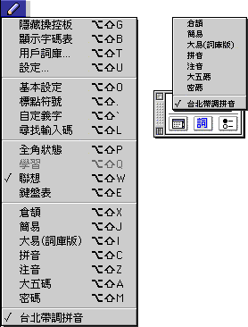

#InputMethod Plug-in Convertor 程式

Plug-in 是 Mac OS 繁體輸入方法一項新加入的功能，使用者可以容易地利用這項功能製作自己的輸入方法。
由於這個 Plug-in 功能可以使用基於文字的檔案，故此使用者可以輕易地將現有 PC 上的輸入方法轉放在 Mac OS 上使用。另一方面，使用者也可以自己定義輸入碼，然後利用建立文字檔案的方法，製作自己適用的輸入方法。

**製作 Plug-in**

| **1** | 使用者首先製作一個純文字檔案（請參閱下面的格式舉例）。您可以使用任何文字處理程式，但必須把檔案儲存為純文字、即“TEXT”類型。                                      |
| ----- | --------------------------------------------------------------------------------------------------------------------------------------------------------------- |
| **2** | 把純文字檔案拖移到 Input Method Plug-in Converter（轉換程式）的圖像上。                                                                                         |
|       | InputMethod Plug-in Converter 在 Apple Extras 的 Chinese Utilities 內的 Input Method Plug-in 檔案夾內。                      |
|       | Input Method Plug-in Converter 程式會把純文字檔案轉換成為一個繁體輸入方法可以使用的檔案，儲存在原來純文字檔案同一個檔案夾內。檔案名稱是原檔案名稱後加上“.dat”。 |
| **3** | 把已轉換的檔案（即名稱後面是“**.dat**”的檔案）拖移到“系統檔案夾”內的“延伸功能”檔案夾內的 Input Method Plug-in 檔案夾內。                                        |
| **4** | 重新開機。                                                                                                                                                      |
|       | 所製作的 Plug-in 名稱會出現在輸入方法清單和操控板內。（如圖例中最下方的“台北帶調拼音”。）                                |
| **5** | 從輸入法清單或操控板的啟動式清單中選擇 Plug-in 輸入方法。                                                                                                       |
| **6** | 按自定義的輸入法輸入。                                                                                                                                          |

**文字檔案格式**

為使系統能正確地使用您所製作的 Plug-in，請遵照指定的檔案格式；您可使用系統提供的樣版。檔案格式主要分為兩部份：標題（header）和內文。
**標題**標題的每行定義為：
METHOD： 現以 TABLE 用作說明
ENCODE： 輸入方法的語系，即 GB 或 BIG-5
PROMPT： Plug-in 的名稱，最多可使用 32 個字元。Plug-in 名稱在重新開機後會出現在輸入方法清單的最下面。
VERSION： Plug-in 的版本，最多可使用 8 個字元。
MAXCODE： 最多的輸入鍵數。這項應為數字。
VALIDINPUTKEY： 在這行定義有效的輸入鍵。應少於 128 個字元。
TERMINPUTKEY： 在此定義終止輸入鍵。當按下這些鍵時，輸入方法會強行將鍵轉換為中文。
BEGINCHARACTER： 開始檔案內文，是字元和詞組定義部份。
ENDCHARACTER： 結束字元和詞組定義部份，應與 BEGINCHARACTER 一起使用。
**檔案內文**檔案內文緊接著標題，以 BEGINCHARACTER 行開始，以 ENDCHARACTER 結束。
從 BEGINCHARACTER 行開始至 ENDCHARACTER 行的檔案內文內，使用者可定義代碼行。代碼行定義為：
codeline ::= keystring, blanks,{character/phrase,(,/,)}\* linebreak
以“#”字元開始的任何行都是注釋，Plug-in Converter 轉換程式會略過。
**文字檔案樣板**以下以文中所提到的“繁體注音”為例。

# begin file heade

METHOD: TABLE
ENCODE: BIG
PROMPT: 繁體注音
VERSION: 1.0
VALIDINPUTKEY: ,-./0123456789;abcdefghijklmnopqrstuvwxyz
TERMINPUTKEY: 3467

# the following line must not be removed

BEGINCHARACTER

# any blank lines is ignored

# each line can contain single characters or phrases

# the delimiter could be either a one-byte or a two-byte comma

1i3 跛,簸 ,蚾,蘋果電腦公司
1i4 播,擘,簸,亳,薜,譒,薄,檗,蘗,繴,挀
1i6 伯,博,柏,泊,勃,搏,渤,駁,白,薄,脖,帛
abc 我們,蘋果,一

# add more code lines below

ENDCHARACTER

[目錄表](TooFmset.htm)
