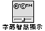
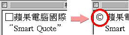
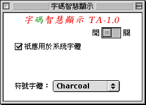
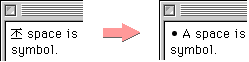
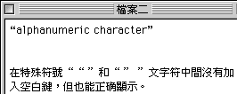
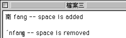

#“字碼智慧顯示”控制面板

“字碼智慧顯示”是一個控制面板，隨 Mac OS 8.5 或更高的中文系統安裝在“控制面板” 檔案夾內。

在中文系統的環境下，使用者安裝英文應用程式時，他們的檔案（在應用程式自己的檔案夾、或“系統檔案夾”內）往往會帶有一些特殊字元。而由於英文系統與繁體、簡體的基本編碼不同，特殊字元在不同的碼表的位置也不一樣，故在中文系統底下顯示這些英文特殊字元時，會變成方框和黑框等亂碼顯示。雖然實際使用這些檔案時不會有問題，但就視覺美觀方面來說始終是一個瑕疵。
“字碼智慧顯示”便是特別為解決特殊字元的顯示問題而開發的。在顯示時，如果發現有這些英文特殊字元時，“字碼智慧顯示”便會自動以一種英文字元來取代，使這些特殊字元能夠正確顯示。

**“字碼智慧顯示”的各項設定**

**開關**如果您看到下面第一行顯示的字和第二行不相同，則需要將“字碼智慧顯示”設置到“開”。
| £ | Ü | ¶ |
| --- | --- | --- |
| | | |
| £ | Ü | ¶ |

[請為我打開“字碼智慧顯示”控制面板。](help:runscript="TC%20IM%20Help:shrd:OpnCntrlPnlSmartView" string="SmartViewCreator")
由於“字碼智慧顯示”在使用上有其他的限制（請參閱下面的說明），使用者可在控制面板內選擇是否使用“字碼智慧顯示”。所作選擇不需重新啟動電腦便可即時生效；但正顯示的文件則須在螢幕畫面重畫以後，才會顯示所作的變動。
**祇應用於系統字體**由於“字碼智慧顯示”在使用上有其他的限制（請參閱下面說明），如果使用者想避免在使用其他字體時（Finder 及一般應用軟體的對話框均設定使用系統字體，即 Taipei 字）也有這些限制，可選取這個選項。
**符號字體**使用者可在這個啟動式清單中選取用以顯示特殊字元的字體，列出的選擇通常是系統所安裝的英文字體。
**注意：**如果所選字體與原來所用的中文字體字寬不同的話，則會影響插入點的位置不正確。（中文系統中建議使用 Charcoal 搭配 Taipei 使用）。

**“特殊字元”的定義**

| �(0x84), | �(0x85), | �(0x86), | �(0x87), |
| -------- | -------- | -------- | -------- |

| �(0x88), | �(0x89), | �(0x8a), | �(0x8b), |
| -------- | -------- | -------- | -------- |

| �(0x8c), | �(0x8d), | �(0x8e), | �(0x8f), |
| -------- | -------- | -------- | -------- |

| �(0x90), | �(0x91), | �(0x92), | �(0x93), |
| -------- | -------- | -------- | -------- |

| �(0x94), | �(0x95), | �(0x96), | �(0x97), |
| -------- | -------- | -------- | -------- |

| �(0x98), | �(0x99), | �(0x9a), | �(0x9b), |
| -------- | -------- | -------- | -------- |

| �(0x9c), | �(0x9d), | �(0x9e), | �(0x9f), |
| -------- | -------- | -------- | -------- |

| �(0xa0), | �(0xa1), | �(0xa2), | �(0xa3), |
| -------- | -------- | -------- | -------- |

| �(0xa4), | �(0xa5), | �(0xa6), | �(0xa7), |
| -------- | -------- | -------- | -------- |

| �(0xa8), | �(0xa9), | �(0xaa), | �(0xab), |
| -------- | -------- | -------- | -------- |

| �(0xac), | �(0xad), | �(0xae), | �(0xaf), |
| -------- | -------- | -------- | -------- |

| �(0xb0), | �(0xb1), | �(0xb2), | �(0xb3), |
| -------- | -------- | -------- | -------- |

| �(0xb4), | �(0xb5), | �(0xb6), | �(0xb7), |
| -------- | -------- | -------- | -------- |

| �(0xb8), | �(0xb9), | �(0xba), | �(0xbb), |
| -------- | -------- | -------- | -------- |

| �(0xbc), | �(0xbd), | �(0xbe), | �(0xbf), |
| -------- | -------- | -------- | -------- |

| �(0xc0), | �(0xc1), | �(0xc2), | �(0xc3), |
| -------- | -------- | -------- | -------- |

| �(0xc4), | �(0xc5), | �(0xc6), | �(0xc7), |
| -------- | -------- | -------- | -------- |

| �(0xc8), | �(0xc9), | ((0xca), | �(0xcb), |
| -------- | -------- | -------- | -------- |

| �(0xcc), | �(0xcd), | �(0xce), | �(0xcf), |
| -------- | -------- | -------- | -------- |

| �(0xd0), | �(0xd1), | �(0xd2), | �(0xd3), |
| -------- | -------- | -------- | -------- |

| �(0xd4), | �(0xd5), | �(0xd6), | �(0xd7), |
| -------- | -------- | -------- | -------- |

�(0xd8),

�(0xd9)

**使用限制**

使用者在使用“字碼智慧顯示”請注意以下三個限制：

| **1** | 特殊字元與英文字元中間一般必須加入一個空白鍵或 Return 鍵，才能正確顯示。                                                                                                                                                                                                                                                                                                                                                                                                                                                                                                                                                                                                                                                                                                                                                                                                         |
| ----- | -------------------------------------------------------------------------------------------------------------------------------------------------------------------------------------------------------------------------------------------------------------------------------------------------------------------------------------------------------------------------------------------------------------------------------------------------------------------------------------------------------------------------------------------------------------------------------------------------------------------------------------------------------------------------------------------------------------------------------------------------------------------------------------------------------------------------------------------------------------------------------- |
|       | 舉例如下：                                                                                                                                                                                                                                                                                                                                                                                                                                                                                                                                                                                                                                                                                                                                                                                                                                  |
| **2** | 以下五個特殊字元““ ”（0xd2）, “ ”” （0xd3）, “ ′”（0xab）, “‘ ”（0xd4）和“ ’”（0xd5）如果之前或之後的是英文文字或數字字元（alphanumeric character，即字母、數字和其他特殊字元）的話，中間不需加入空白鍵或 Return 鍵，都能正確顯示。                                                                                                                                                                                                                                                                                                                                                                                                                                                                                                                                                                                                                                              |
|       | 舉例如下：                                                                                                                                                                                                                                                                                                                                                                                                                                                                                                                                                                                                                                                                                                                                                                                                                                  |
| **3** | 中文字元的大五碼如果是以這五個特殊字元作為首碼，而之前或之後的是英文文字或數字字元的話，中間便需加入一個空白鍵，否則便會出現亂碼的情況。舉例如下：  **受影響的中文字元包括：** 陂隹雨青非亟亭亮信侵侯便俠俑俏保促侶俘俟俊俗侮俐俄係俚俎俞侷兗冒冑冠剎剃削前剌剋則勇勉勃勁匍南卻厚叛咬哀咨哎哉咸咦咳哇哂咽咪品毨毣毢毧氥浺浣浤浶洍浡涒浘浢浭浯涑涍淯浿涆浞浧浠涗浰浼浟涂涘洯浨涋浾涀涄洖涃浻浽浵涐烜烓烑烝烋缹烢烗烒烞烠烔烍烅烆烇烚烎烡牂牸笄笓笅笏笈笊笎笉笒粄粑粊粌粈粍粅紞紝紑紎紘紖紓紟紒紏紌罜罡罞罠罝罛羖羒翃翂翀耖耾耹胺胲胹胵脁胻脀舁舯舥茳茭荄茙荑茥荖茿荁茦茜茢酎酏釕釢釚陜陟隼飣髟鬯乿偰偪偡偞偠偓偋偝偲偈偍偁偛偊偢倕偅偟偩偫偣偤偆偀偮偳偗偑凐剫剭剬剮勖勓匭厜啵啶唼啍啐唴唪啑啢唶唵唰啒啅崰崒崣崟崮帾帴庱庴庹庲庳弶弸徛徖徟悊悐悆悾悰悺惓惔惏惤惙惝惈悱惛悷惊悿惃惍惀挲捥掊掂捽掽掞掭掝掗掫掎捯掇掐据掯捵掜捭掮捼掤挻掟 |
| **4** | 如果句子內有特殊字元的話，使用者在刪除文字時，可能會引致亂碼的情況。                                                                                                                                                                                                                                                                                                                                                                                                                                                                                                                                                                                                                                                                                                                                                                                                             |

[目錄表](TooFmset.htm)
